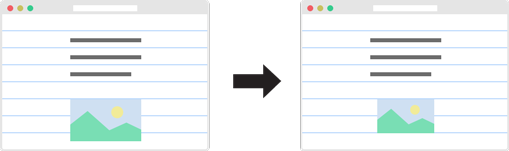

# Gutenberg
## A Meaningful Web Typography Starter Kit
Gutenberg is a work–in–progress project by [Matej Latin](http://matejlatin.co.uk) that brings meaning and craftsmanship to web typography.

[View Example](http://matejlatin.github.io/Gutenberg/example)

###Made with Sass
Gutenberg is a flexible and simple–to–use starter kit made with Sass. It’s a small step towards a better web typography. Beautiful typographic styles can be made by setting base type size, line-height (leading) and measure (max-width).

>The reader should be able to read the message of a text easily and comfortably. This depends to a not inconsiderable extent on the size of the type, the length of the lines and the leading.
>
>—Josef Mueller–Brockmann

Gutenberg sets the baseline grid to establish a proper vertical rhythm and makes sure all elements fit into it. It sets up the macro typography so you can focus on the micro–typographic details.

###Base type & line-height
All calculations in Gutenberg depend on base type size and line-height. Multiplication of these two results in leading which is essential for setting a correct vertical rhythm and a baseline grid.

```sass
$base-font-size: 100; // Equals 16px
$line-height: 1.6;
$leading: $base-type * $line-height;
```

###Vertical rhythm and baseline grid
By calculating the leading Gutenberg sets a vertical rhythm by resetting line-height and margins for all elements.

```sass
* {
  line-height: $leading;
  margin-bottom: $leading;
}
```

Correct vertical rhythm results in consistent spacing between elements that helps clarifying the structure and order of the content and link it with other elements. Its’ ultimate goal is to _invite the reader into the text_ and _improve the readability_.

###Correct but flexible
To make Gutenberg more flexible but still correct, _half of leading sizes_ can be used. For example: heading 2 has a default margin-top of 2.5 leading and a line-height of 1.5 leading.

```sass
h2 {
  margin-top: #{2.5 * $leading + 'rem'};
  line-height: #{1.5 * $leading + 'rem'};
}
```

###Modular scale
Typographers have been using scales for centuries. Gutenberg is based on Tim Brown’s [Modular Scale](http://modularscale.com) to bring meaning and harmony to the typographic style.

###Mobile first
Gutenberg sets base type size, line-height and calculates the leading for the mobile screens first. The break point is calculated based on maximum (ideal) width of elements. When a screen is wider than that, it resets and recalculates all the sizes so they better fit for desktop screens.

```sass
// Base sizes
$base-font-size: 100 !default;
$base-font-size-desktop: 112.5 !default;
$line-height: 1.625;
$line-height-desktop: 1.8;
$max-width: 35;
```

###Themes & customization
Gutenberg comes with two beautiful predefined themes based on two typefaces provided by Google Fonts: Merriweather and Open Sans.

There is a custom option that allows loading custom typefaces for body text and headings.

```sass
$theme: custom; // [ Merriweather / OpenSans / custom ]
$custom-font-body: Merriweather, serif;
$custom-font-headings: "Open Sans", sans-serif;
```

###Sass Mixins
Sass makes it easy to understand and reuse most parts of the code. Line-heights, margins, paddings and font-sizes are all calculated based on base font-size and leading. So there’s a mixin for each that sets its value in both pixels (fallback) and REMs. Below is an example of a mixin that sets the bottom margin to x numbers of leading.

```sass
// Margin-bottom
@mixin margin-bottom($number){
  margin-bottom: #{$number * $leading + 'px'};
  margin-bottom: #{$number * $leading-rem + 'rem'};
}
```

###Fix image height
Images and figures are resized so they don’t break the baseline grid. This small and lightweight JavaScript function takes the original height of a figure and calculates a new height which is a multiplication of leading.



##Why Gutenberg?
Johannes Gutenberg invented a printing press with movable type more than 500 years ago. His invention led to improved readability of books and enabled a distribution on a large scale. His invention improved a medium and took it to another level. This web typography starter kit aims to do exactly the same for another medium — the web.

##Contribute
Gutenberg is an open source project licensed under [Creative Commons 3.0](https://creativecommons.org/licenses/by-sa/3.0/). Feel free to use, adapt or contribute.

---

##History
###Gutenberg v1.1

*Jan 20, 2016*

- Code optimized and simplified by use of mixins,
- horizontal rule styling now more flexible with its own configuration,
- Attention Grabber — a new element,
- quotes — an alternative to blockquotes; can be floated,
- added an option for paragraph indenting.

###Gutenberg v1.0

*Jan 20, 2016*

- Includes the basic elements: headings, paragraph, figure, blockquote & cite, horizontal rule, code, sub, sup, ul, ol, small,
- Gutenberg reset — based on Normalize,
- headings, body and links colors,
- two default themes & custom theme options,
- mobile first with a breakpoint for desktop screens,
- sizes based on Perfect Fifth modular scale,
- fixImgHeight.js — a small & lightweight script that resizes images so they fit the baseline grid.